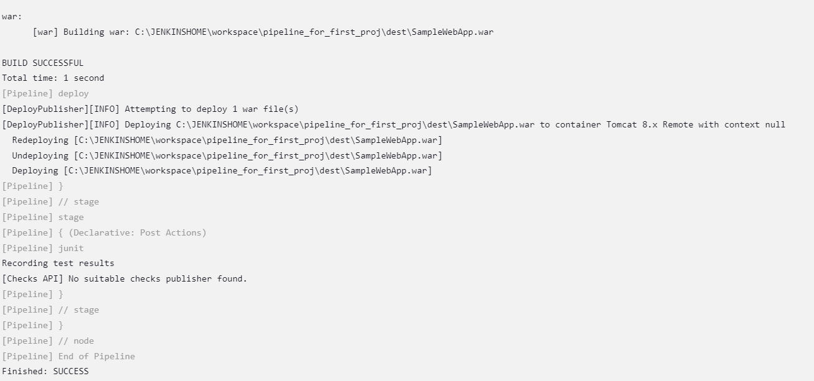

HELLO EVERYONE!!! 

MY FIRST PROJECT ON [ CI - CD] CONTINUOUS INTEGRATION AND CONTINUOUS DEPLOYMENT 
 
 DEPLOYING A JAVA BASED WEB APPLICATION ON TOMCAT CONTAINER: IN TWO WAYS 
1.	FREE STYLE 
2.	PIPELINE 

THIS PROJECT IS ABOUT BUILDING, TESTING AND DEPLOYING A JAVA WEB APPLICATION USING TOOLS 
1.	ANT
2.	JENKINS
3.	GIT & GITHUB
4.	 APACHE TOMCAT
5.	JAVA

I HAVE INSTALLED THE REQUIRED SOFTWARES AND CONFIGURED THEM AS REQUIRED IN MY LOCAL SYSTEM . 
AFTER THAT I HAVE DOWNLOADED jenkins.war FILE AND I DEPLOYED IT IN APACHE TOMCAT SERVER, AND I USED JENKINS TO BUILD THE FREE-STYLE JOBS .
I HAVE INSTALLED REQUIRED PIPELINES FOR THE JOBS .
I HAVE CREATED FOUR JOBS :

1. TO PULL CODE FROM GIT HUB. 
   - I USED BUILD TRIGGER  POLL SCM , WHICH HEPLS TO RUN THE JOB AUTOMATICALLY WHEN THERE IS A CHANGE IN THE GIVEN GITHUB REGISTORY.
   -  USING POST BUILD ACTIONS 
       BY SELECTING  BUILD OTHER PROJECTS , I HAVE TRIGGERED Second JOB TO BUILD AUTOMATICALLY  AFTER THE FIRST JOB BUILD IS DONE .
2. TO BUILD THE CODE USING ANT :
    - I HAVE GIVEN SOURCE CODE URL PRESENT IN GITHUB 
    - USING 'ANT CHECKSTYLE' COMMAND I HAVE BUILT THE CODE.
    - AND AGAIN BY USING POST BUILD ACTIONS , I HAVE TRIGGRED  THE THIRD JOB.
3. TO TEST THE CODE USING ANT :
    - USING 'ANT JUNIT' COMMAND TO TEST THE CODE.
    - TO GET RESULT REPORTS OF THE TEST I HAVE CREATED A .XML FILE IN HTE POST BUILD ACTIONS .
    - THEN I TRIGGERD FOUTH JOB.
4.  TO DEPLOY THE .war file .
    -  USING 'ANT CHECKSTYLE' COMMAND I HAVE BUILT THE .war file .
    - IN THE POST BUILD ACTIONS I HAVE CREATED A TOMCAT CONTAINER TO DEPLOY THE .war FILE BY GIVING THE TOMCAT URL ,CREDENTIALS.

AND FINALLY THE APPLICATION WAS DEPLOYED IN THE TOMCAT CONTAINER . 
MY TOMCAT SERVICE IS RUNNING ON PORT 8080 , SO BY DOING http://localhost:8080/SampleWebApp Ihave accessed the application . 

2)  PIPELINE :
    - I HAVE WROTE THE GROOVY SCRIPT OF THE PIPELINE  IN THE jenkinsfile  I HAVE  SHARED WHICH HAS THE STAGES AND STEPS FROM PULLING THE CODE FROM GITHUB TO DEPLOYING THE .war FILE IN THE TOMCAT CONTAINER . 

    AND IT SHOWED IN THE CONSOLE OUTPUT AS : 

THANK YOU !!!

 

